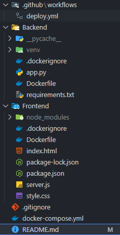

# 🐱 Cat Facts - Proyecto Web Distribuido

¡Bienvenido a **Cat Facts**!  
Este es un proyecto web que consume una API pública para mostrar datos curiosos sobre gatos. Está dividido en dos componentes principales:

- **Backend**: Construido con **Flask (Python)**.
- **Frontend**: Desarrollado con **Node.js + Express + HTML/CSS/JS**.

---


## 🚀 Tecnologías Usadas

### 🔧 Backend
- Python 3
- Flask
- Requests

### 🎨 Frontend
- Node.js
- Express.js
- HTML5 + CSS3 + JS
- node-fetch

### 🐳 DevOps
- Docker & Docker Compose
- GitHub Actions (`deploy.yml` para CI/CD)

---

## 🔍 Estructura del Proyecto




---

## 🛠️ ¿Cómo correrlo localmente?

### Requisitos previos
- Tener **Python 3**, **Node.js**, **npm** y **Docker** instalados.

### 🔥 Opción 1: Modo Local Manual

```bash
# Ejecutar el backend
cd Backend
pip install -r requirements.txt
flask run


# Ejecutar el frontend
cd ../Frontend
npm install node-fetch@2
node server.js

Accede a http://localhost:3000 en tu navegador.
```


### 🐳 Opción 2: Usando Docker Compose

docker-compose up --build
Esto levantará tanto el backend como el frontend automáticamente.

Accede a http://localhost:3000


### 📡 ¿Cómo funciona?
El frontend hace una solicitud a /fact.

Esta solicitud se redirige al backend Flask en /api/catfact.

El backend consulta la API pública https://catfact.ninja/fact.

Se devuelve el dato curioso al cliente final.


### 📁 Archivos Importantes
Backend/app.py: API que obtiene un dato de gato.

Frontend/server.js: Servidor que conecta frontend con backend.

docker-compose.yml: Orquestación de ambos servicios.

style.css: Estilos para una experiencia visual agradable.

.github/workflows/deploy.yml: Flujo de trabajo para despliegue automatizado.